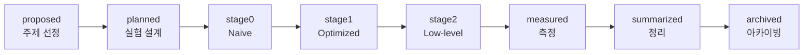

# PerfLab 진행 가이드

주제 하나를 처음부터 끝까지 진행하는 방법을 정리한 문서다. **사람이 읽는 기준 문서**이고, Claude가 따르는 상세 절차는 `.claude/` 아래에 있다.

| 문서 | 독자 | 내용 |
|---|---|---|
| [README](../README.md) | 처음 보는 사람 | 프로젝트 소개, 주제 목록 |
| **GUIDE (이 문서)** | 진행하는 사람 | 파이프라인, 역할, 명령어, 측정 해석 |
| [CONVENTIONS](CONVENTIONS.md) | 코드를 쓰고 읽는 사람 | 포맷, 이름, 주석, Stage 파일 구조 |
| [COMMITS](COMMITS.md) | 커밋하는 사람 | 커밋 제목과 본문 형식, 설정 변경 기록법 |
| `CLAUDE.md`, `.claude/` | Claude | 단계별 절차(skill), 규칙, 리뷰 에이전트 |

---

## 1. 한눈에 보기



- `topic.json`의 `status`는 **마지막으로 끝낸 단계**를 뜻한다. `stage1`은 "Stage 1 구현까지 끝났다"는 의미다.
- 상태는 `scripts/perflab advance`로만 바꾼다. advance는 다음 단계의 완료 조건을 검사하고, 통과해야만 전환한다.
- 한 번에 한 단계씩 진행한다. 단계가 끝나면 Claude가 보고하고 멈추며, "계속"이라고 하면 다음 단계로 간다.

## 2. 역할 분담

| | 나 (사람) | Claude |
|---|---|---|
| 하는 일 | 예측, 질문, 결정, 이해 확인 | 설계, 구현, 측정, 문서 작성 |
| 체크포인트 | 질문에 먼저 답한다 (틀려도 괜찮다) | 답을 받기 전에는 다음 작업을 하지 않는다 |
| 기록 | — | 내 답을 원문 그대로 `docs/LEARNING.md`에 남긴다 |

체크포인트는 **설명을 듣기 전에 먼저 예측**하게 만드는 장치다. 예측과 실제의 차이가 이 프로젝트에서 가장 중요한 학습 자료다. 모르겠으면 "모르겠다"도 좋은 답이고, "스킵"하면 스킵했다고 기록한다.

## 3. 단계별 진행

Claude Code에서 `/perflab`을 실행하면 현재 상태에 맞는 단계를 이어서 진행한다. `/perflab new`는 새 주제, `/perflab status`는 상태 확인이다.

| 단계 | 내가 하는 일 | Claude가 하는 일 | 산출물 | 완료 조건 (advance가 검사) |
|---|---|---|---|---|
| **proposed** | 후보 3개 중 하나 고르기 | 후보 제안, `perflab new`로 주제 폴더 생성 | `topic.json` | 메타데이터, 패키지와 카탈로그 등록 |
| **planned** | ① 병목 예측, 내가 만든다면 어떻게 만들지 ② 계획 승인 | 시나리오, 지표, Stage 전략 설계 | `docs/PLAN.md`, `Scenario.swift` | PLAN과 Scenario에 TODO 없음, LEARNING `[Plan]` |
| **stage0~2** | ① 이 전략이 왜 빠를지, 대가는 무엇인지 예측 ② 핵심 변경 이해 확인, 시뮬레이터에서 HUD 보기 | UIKit과 SwiftUI 구현, 정합성 테스트, 공정성 리뷰 | `UIKit/`, `SwiftUI/`, `Tests/` | 마커 제거, 머리말(`// 전략:`), lint 통과, LEARNING `[Stage N]` |
| **measured** | ① 결과 보기 전 수치 예측 ② 예측과 다른 이유 함께 추론 | Release 자동 측정, 결과표, 분석 | `results/`, `docs/RESULTS.md` | 한 기기에서 모든 조합과 baseline 결과, LEARNING `[Measure]` |
| **summarized** | 초안 리뷰, "한 문장으로 설명하면?" | 블로그용 글 작성 | `docs/SUMMARY.md` | TODO 없음 |
| **archived** | 회고: 파이프라인에서 바꾸고 싶은 점 | README 표 갱신 | README | README에 등록 |

각 단계가 끝날 때 Claude가 커밋할지 묻는다. 커밋 메시지는 `[#NN] <status>: <요약>` 형식이고, 본문은 [COMMITS](COMMITS.md)를 따른다.

## 4. 명령어

```bash
# 상태
scripts/perflab status                    # 전체 주제와 다음 단계
scripts/perflab validate <topic>          # 현재 상태 조건 검사
scripts/perflab advance <topic>           # 다음 상태로 전환 (조건 통과 시)

# 개발
scripts/perflab build                     # 앱 빌드 (기본 시뮬레이터)
scripts/perflab test <topic>              # 주제 단위 테스트
scripts/perflab format [경로...]          # swift-format 자동 정리
scripts/perflab lint [경로...]            # swift-format 검사

# 측정
scripts/perflab devices                   # 기기 목록
scripts/perflab measure <topic> [--device "<실기기>"] [--repeat 3]
scripts/perflab table <topic>             # RESULTS.md 결과표 생성

# 아카이빙
scripts/perflab readme                    # README Topics 표 갱신
```

`<topic>`은 id(`01-image-feed-scroll`)나 번호(`01`, `1`)로 쓴다.

## 5. 측정 방식과 지표 해석

### 측정 절차

`scripts/perflab measure`는 UI 테스트로 앱을 조합마다 새로 실행해 측정한다.

1. Release 빌드로 실행한다.
2. 앱 실행 → warm-up 2초 → 10초 녹화 → 앱 종료. 측정 중에는 HUD를 숨긴다.
3. 한 회차에 **Baseline → 모든 Stage×Framework**를 한 번씩 돌린다. 이것을 기본 3회 반복하고 지표별 **중앙값**을 쓴다.
   - 회차 단위로 섞어 돌리는 이유: 기기 발열처럼 시간이 지나며 생기는 변화가 특정 조합에만 몰리지 않게 하기 위해서다.
   - 회차별 원본은 결과 JSON의 `runs`에 남는다. 편차가 20%를 넘는 지표는 측정 중에 경고로 출력된다.
4. Stage 구현이 끝나지 않은 주제는 측정하지 않는다. 파이프라인 점검용으로만 `--allow-incomplete`를 쓴다.

조합 6개와 baseline을 3회씩 측정하면 대략 5~6분 걸린다.

### Baseline

부하가 없는 빈 화면을 Stage와 같은 조건에서 측정한 값이다. 측정 환경 자체가 만드는 노이즈(실행 직후의 시스템 작업, 시뮬레이터 지터 등)의 **바닥값**이다. Stage 간 차이가 Baseline 수준이라면 의미 있는 차이로 보지 않는다.

### 지표

| 지표 | 수집 방법 | 의미와 한계 |
|---|---|---|
| FPS avg / min | `CADisplayLink` 콜백 횟수를 0.5초 구간마다 집계 | **메인 스레드가 매 프레임을 제때 처리했는가.** min은 가장 나빴던 0.5초 구간이다. display link를 기기 최대 주사율(ProMotion 120Hz)로 요청한다. |
| Hitch count / ratio | 프레임 간격이 기대치의 1.5배를 넘으면 hitch로 센다. ratio는 초당 밀린 시간(ms/s) | Apple의 Hitch Time Ratio와 같은 개념이다. **렌더 서버(GPU) 단계의 hitch는 잡히지 않는다.** 필요하면 Instruments의 Animation Hitches로 확인한다. |
| CPU avg / peak (%) | `getrusage`로 구한 프로세스 CPU 시간의 구간 차이 ÷ 경과 시간 | 100% = 코어 1개를 완전히 사용. 측정 구간에 끝난 스레드도 포함한다. |
| Memory avg / peak (MB) | `task_info(TASK_VM_INFO).phys_footprint` | Xcode Memory Gauge, Jetsam과 같은 기준이다. |
| Threads peak | `task_threads` | 샘플링 시점의 스레드 수라서, 순간적으로 생겼다 사라진 스레드는 놓칠 수 있다. |
| 주제별 지표 | `context.metrics` | 주제마다 PLAN.md에 정의한다. |

측정 코드 자체의 비용은 0.5초마다 수 µs 수준이라 결과에 영향을 주지 않는다.

### 시뮬레이터와 실기기

정식 결과는 **실기기 + Release**다. 시뮬레이터는 Mac CPU와 GPU를 쓰기 때문에 수치는 참고용이며, 결과표에 그렇게 표시된다.

## 6. 처음 준비

- Xcode 26 이상, iOS 26 시뮬레이터 (`scripts/perflab build`가 iPhone 17 Pro를 자동으로 찾는다)
- 실기기 측정 (measure 단계 전까지 준비):
  1. 기기를 연결하고 Xcode의 Devices 창에서 페어링한다.
  2. PerfLab 타깃과 PerfLabUITests 타깃의 Signing에서 Team을 지정한다.
  3. `scripts/perflab devices`에 기기 이름이 나오는지 확인한다.

## 7. 막혔을 때

| 상황 | 해결 |
|---|---|
| `advance`가 실패한다 | 출력된 미충족 항목을 해결한다. 검사를 우회하거나 `topic.json`을 직접 고치지 않는다. |
| lint 위반 | `scripts/perflab format <주제 경로>`로 자동 수정한다. |
| 측정 결과의 편차가 크다 | 기기 발열, 저전력 모드, 백그라운드 앱을 확인하고 다시 측정한다. 재측정한 사실은 RESULTS.md에 기록한다. |
| 계획이 구현과 맞지 않는다 | 구현을 멈추고 PLAN.md 수정을 논의한다. 계획을 몰래 바꾸지 않는다. |
| Shared를 고쳐야 할 것 같다 | 모든 주제에 쓸 수 있는 일반적인 기능인지 먼저 따진다. Claude는 고치기 전에 알린다. |
